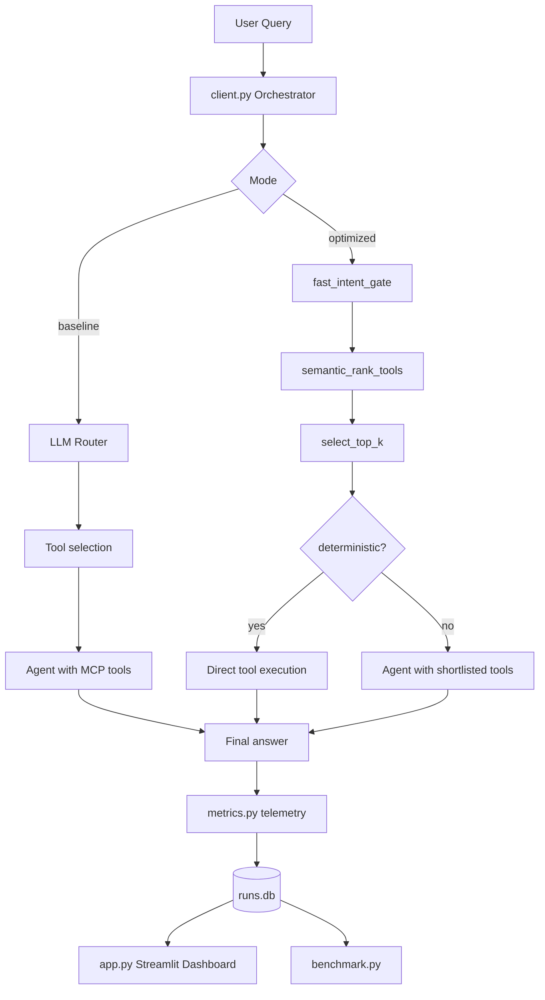
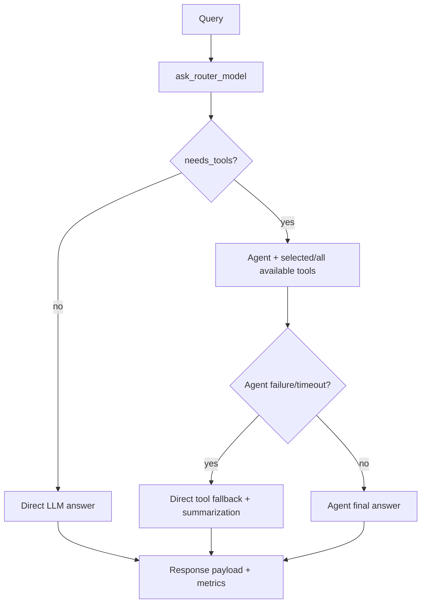
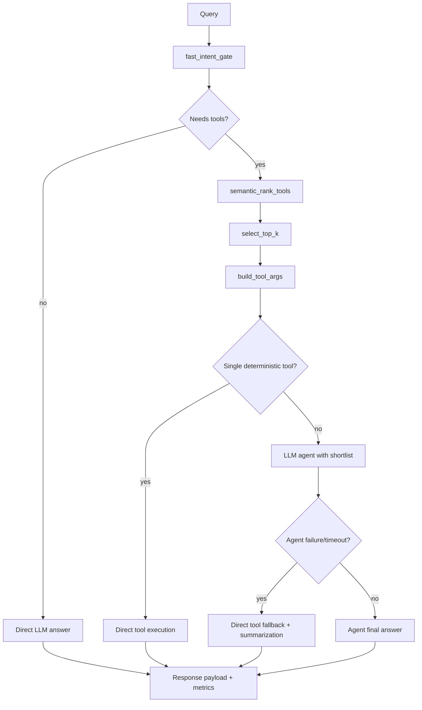
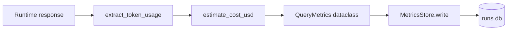
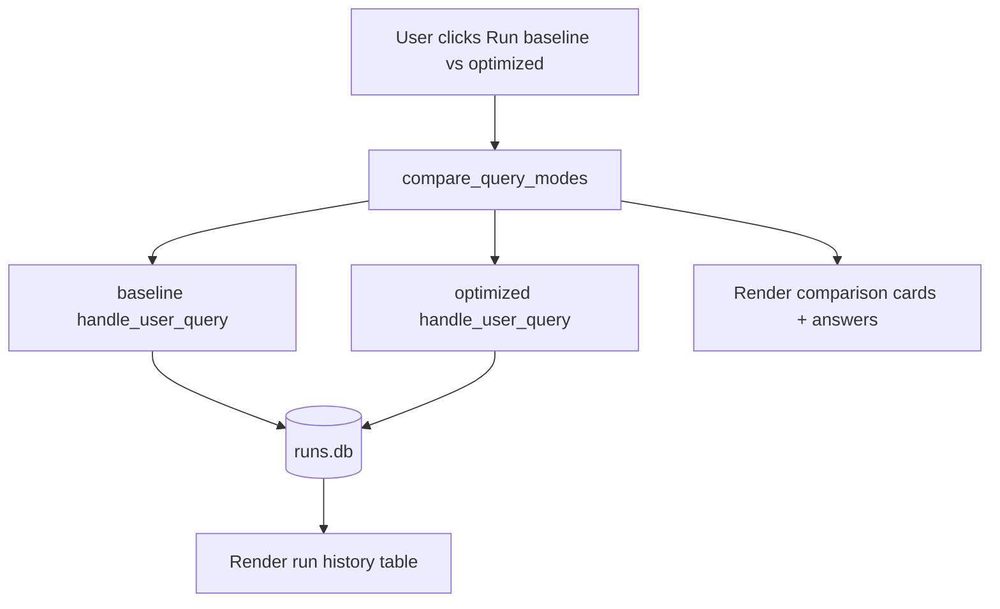

# MCP Optimization

MCP Optimization is a baseline-vs-optimized tool-routing application for MCP-enabled LLM workflows.

It provides:

- a **baseline pipeline** (naive / broad tool usage)
- an **optimized pipeline** (intent gate + semantic ranking + top-k tool selection)
- side-by-side comparison in CLI and Streamlit UI
- persisted telemetry (`runs.db`) for latency, tool usage, cost estimates, and reliability

---

## 1) Problem this project solves

In naive tool-calling systems, the model often sees too many tools and may over-call them. This increases:

- response latency
- tool-call count
- model context overhead
- overall inference cost

This project introduces a practical routing layer that keeps correctness while reducing unnecessary tool exposure.

---

## 2) End-to-end architecture



---

## 3) Repository structure

- `client.py`  
	Main async orchestrator. Supports modes:
	- `baseline`
	- `optimized`
	- `compare`

- `server.py`  
	MCP server exposing search, translation, and paraphrasing tools.

- `optimizer.py`  
	Optimization policy logic:
	- `fast_intent_gate()`
	- `semantic_rank_tools()`
	- `select_top_k()`
	- `build_optimized_plan()`

- `tool_catalog.py`  
	Tool metadata used for ranking, defaults, and deterministic eligibility.

- `metrics.py`  
	Telemetry model + SQLite writer + token/cost extraction.

- `benchmark.py`  
	Runs A/B evaluation using queries from `eval_queries.jsonl`.

- `app.py`  
	Streamlit UI for side-by-side comparison, benchmark summary, and run history.

- `eval_queries.jsonl`  
	Benchmark query set.

- `requirements.txt`  
	Runtime dependencies. (`transformers`/`torch` path is optional in current setup.)

---

## 4) Baseline flow (current implementation)



Notes:

- Router failure falls back to a safe plan.
- Agent and tool calls are timeout-protected.
- Error fallback still returns a user-facing answer when possible.

---

## 5) Optimized flow (key logic)



Optimization intent:

- reduce tool context surface
- reduce unnecessary tool calls
- keep direct/low-latency path for simple tasks

---

## 6) MCP server tools

### Search

- `search_articles`
- `search_research_papers`
- `search_lit_reviews`

### Translation

- `translate_japanese`
- `translate_french`
- `translate_spanish`

### Paraphrasing

- `paraphrase_formal`
- `paraphrase_casual`
- `paraphrase_academic`

---

## 7) Metrics and persistence

Each query run writes one row into `runs.db`.

Tracked fields include:

- `mode`
- `latency_ms`
- `tools_considered`
- `selected_tools_count`
- `tool_calls_executed`
- `router_confidence`
- `input_tokens`, `output_tokens` (best effort)
- `estimated_cost_usd`
- `success`
- `error_type`
- `selected_tools_json`
- `metadata_json`

### Metrics pipeline



---

## 8) Comparison math

For `compare` mode and benchmarking:

$$
	ext{latency\_improvement\_pct} = \frac{L_{baseline} - L_{optimized}}{L_{baseline}} \times 100
$$

$$
	ext{tools\_reduction\_pct} = \frac{T_{baseline} - T_{optimized}}{T_{baseline}} \times 100
$$

$$
	ext{cost\_improvement\_pct} = \frac{C_{baseline} - C_{optimized}}{C_{baseline}} \times 100
$$

---

## 9) Streamlit UI behavior

The dashboard in `app.py` provides:

1. **Live Comparison**  
	 Baseline on top, Optimized below, with prominent metrics and status.

2. **Benchmark Summary**  
	 Aggregate metrics across `eval_queries.jsonl`.

3. **Run History**  
	 Last runs from `runs.db` in tabular form.

UI flow:



---

## 10) Configuration (.env)

Create `.env` in project root:

```env
GROQ_API_KEY=your_groq_api_key_here

# optional; defaults to ./server.py
MCP_SERVER_PATH=C:/Users/lenovo/Desktop/MCP/MCP-Optimization/server.py

# reliability/performance controls
AGENT_TIMEOUT_SECONDS=60
TOOL_TIMEOUT_SECONDS=20

# arXiv lookup switch in server search path
USE_ARXIV=0
```

---

## 11) Setup and run

Install:

```bash
pip install -r requirements.txt
```

Run optimized query:

```bash
python client.py --mode optimized --query "Find recent research papers on MCP optimization"
```

Run baseline query:

```bash
python client.py --mode baseline --query "Find recent research papers on MCP optimization"
```

Run side-by-side compare:

```bash
python client.py --mode compare --query "Translate this to Japanese: Thank you for your support"
```

Run benchmark:

```bash
python benchmark.py
```

Launch dashboard:

```bash
streamlit run app.py
```

---

## 12) Reliability behavior and fallbacks

The orchestrator is designed to return useful output even during partial failures:

- router parse failure → fallback plan
- agent timeout/failure → direct tool fallback + summary
- outer exception → direct model fallback answer
- missing optional dependencies in server tools → graceful fallback messages

---

## 13) Current limitations

- Token usage extraction depends on provider response shape (best effort).
- Translation backend can vary by `googletrans` version/network behavior.
- Search quality/latency can vary by external API response times.
- Comparison results can be query-dependent (optimized may occasionally call more tools).

---

## 14) Recommended next improvements

- Add strict schema validation for router-selected `tool_args`.
- Add per-tool cooldown and historical success weighting.
- Add richer evaluation set with correctness labels.
- Add charts in UI for trend lines over time.